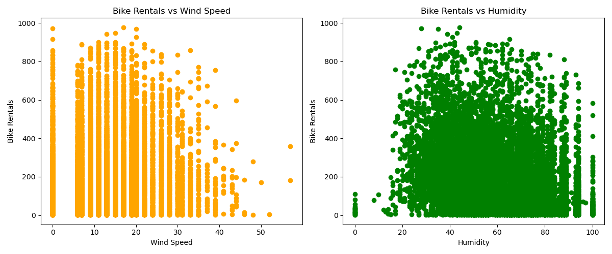
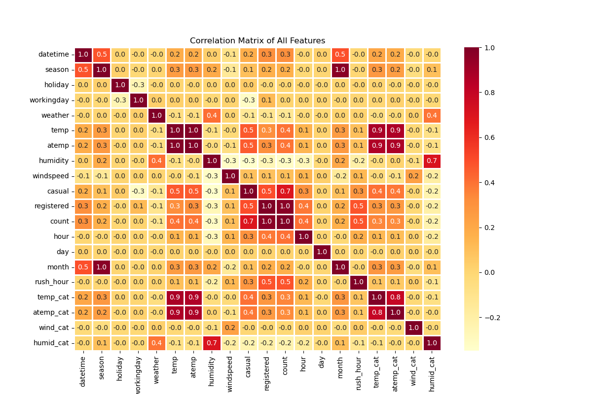
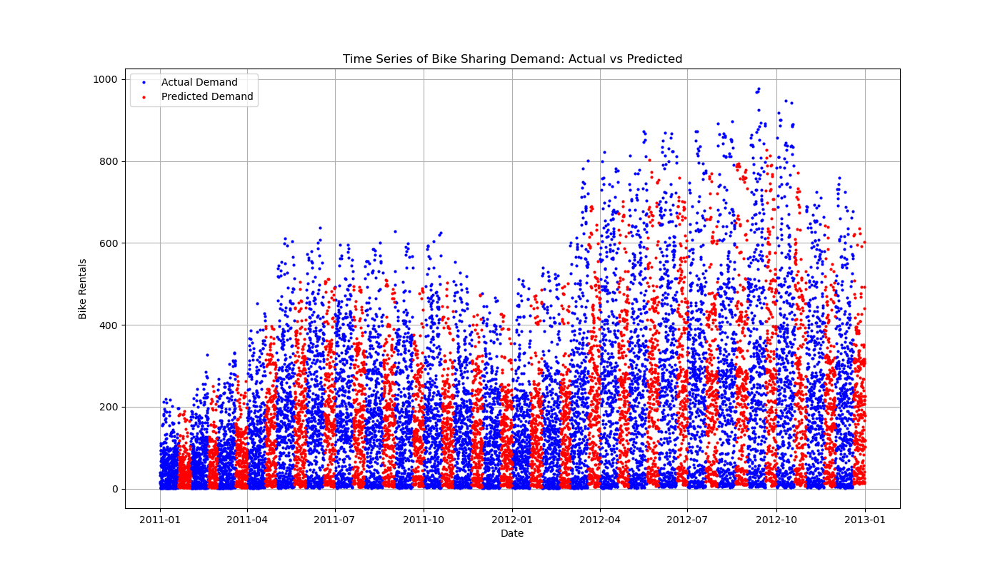
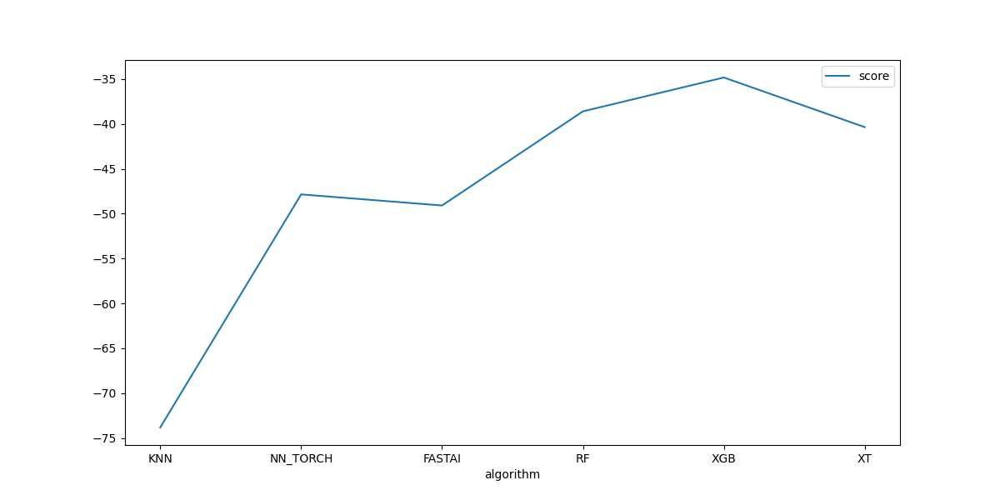
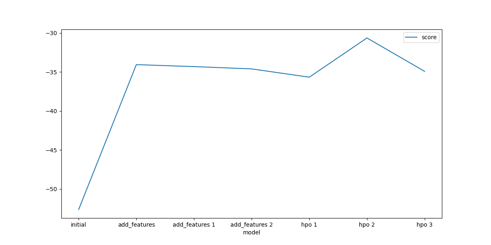
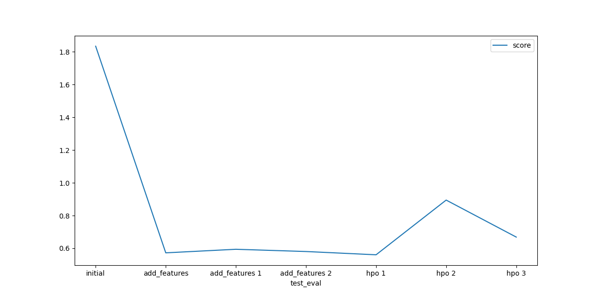

# Report: Predict Bike Sharing Demand with AutoGluon Solution
#### Partist Poopat

## Initial Training
### What did you realize when you tried to submit your predictions? What changes were needed to the output of the predictor to submit your results?

From the initial training predictions, which used only the datetime feature with a 1-hour time interval across different dates, the average bike rental count was 100 per hour. However, the predicted rental range per hour varied significantly, from 2 to 362, with a standard deviation of 91. This high variation was due to focusing solely on date-hour relationships, which led to poor predictive accuracy. Additionally, since bike rentals cannot be negative in real-world scenarios, I set any negative predicted values to zero.

### What was the top ranked model that performed?
| Model                    | Score Val   | Eval Metric            | Pred Time Val | Fit Time   | Pred Time Val Marginal | Fit Time Marginal | Stack Level | Can Infer | Fit Order |
|--------------------------|-------------|-------------------------|---------------|------------|------------------------|-------------------|-------------|-----------|-----------|
| WeightedEnsemble_L3      | -52.623957  | root_mean_squared_error | 5.640454      | 34.024922  | 0.000000               | 0.207320          | 3           | True      | 36        |
| RandomForest_r127_BAG_L2 | -52.841071  | root_mean_squared_error | 4.597601      | 18.773440  | 0.265699               | 5.236645          | 2           | True      | 27        |
| RandomForestMSE_BAG_L2   | -53.069944  | root_mean_squared_error | 4.693997      | 22.463723  | 0.362095               | 8.926928          | 2           | True      | 20        |

 

 WeightedEnsemble_L3 with an RMSE evaluation score of -52.623057.

## Exploratory data analysis and feature creation
### What did the exploratory analysis find and how did you add additional features?

* The Datetime feature is in date-hour format, so I seperate into hour, day, month columns.
* Season, Weather, Holiday,and Workingday columns are integer values, which I convert to category types.
* Add a feature that categorizes morning, lunch, and evening rush hour.
* Added a feature that categorizes temperature into hot, cold, and mild categories.
* Added a feature that categorizes apparent temperature into hot, cold, and mild categories.
* Add a feature that categorizes windspeed into very windy and mild wind.
* Add a feature that categories humidity into very humid and not humid.

 

High wind speed and humidity tend to cause a drop in bike rentals.
### How much better did your model preform after adding additional features and why do you think that is?

| Model                    | Score Val   | Eval Metric              | Pred Time Val | Fit Time   | Pred Time Val Marginal | Fit Time Marginal | Stack Level | Can Infer | Fit Order |
|--------------------------|-------------|--------------------------|---------------|------------|------------------------|-------------------|-------------|-----------|-----------|
| WeightedEnsemble_L3      | -34.067984  | root_mean_squared_error  | 5.814933      | 36.497797  | 0.000000               | 0.211555          | 3           | True      | 36        |
| RandomForest_r127_BAG_L2 | -34.252803  | root_mean_squared_error  | 4.802239      | 21.095819  | 0.275347               | 6.610309          | 2           | True      | 27        |
| RandomForest_r15_BAG_L2  | -34.297120  | root_mean_squared_error  | 4.810133      | 19.595833  | 0.283242               | 5.110323          | 2           | True      | 32        |

 

* The top rank model, WeightedEnsemble_L3, show improvement with an RMSE score of -34.067984. 
* The 7 most important contribuition to the model are hour, datetime, workingday, humidity, atemp, and weather, respectively.
* The features windspeed, season, and holiday showed less importance to the model, with feature importance scores below 3.

 

| Feature     | Importance  | StdDev    | p_value       | n | p99_high   | p99_low    |
|-------------|-------------|-----------|---------------|---|------------|------------|
| hour        | 183.639092  | 1.653355  | 7.883852e-10  | 5 | 187.043373 | 180.234811 |
| datetime    | 97.109552   | 1.296072  | 3.806688e-09  | 5 | 99.778183  | 94.440921  |
| workingday  | 49.939317   | 1.899163  | 2.505086e-07  | 5 | 53.849719  | 46.028915  |
| humidity    | 22.442638   | 1.629266  | 3.309847e-06  | 5 | 25.797319  | 19.087956  |
| atemp       | 19.238002   | 0.883461  | 5.321948e-07  | 5 | 21.057060  | 17.418943  |
| temp        | 15.297162   | 0.600045  | 2.835195e-07  | 5 | 16.532663  | 14.061660  |
| weather     | 14.225706   | 1.171473  | 5.468884e-06  | 5 | 16.637785  | 11.813626  |
| day         | 3.826587    | 0.180254  | 5.891054e-07  | 5 | 4.197733   | 3.455441   |
| month       | 3.008581    | 0.067691  | 3.073092e-08  | 5 | 3.147959   | 2.869204   |
| windspeed   | 2.608243    | 0.196375  | 3.827032e-06  | 5 | 3.012583   | 2.203903   |
| season      | 1.611888    | 0.102477  | 1.949865e-06  | 5 | 1.822889   | 1.400887   |
| holiday     | 0.731834    | 0.265769  | 1.765199e-03  | 5 | 1.279056   | 0.184612   |

Adding the hour feature improved performance, as bike rentals are likely to depend heavily on the hour of the day. However, additional features, such as categorizing rush hour, temperature, windspeed, and humidity, did not outperform the original continuous value features in term of feature importance score and model performance. As a result, these features had to be excluded from the training.

## Hyper parameter tuning
### How much better did your model preform after trying different hyper parameters?
| Model               | Score Val   | Eval Metric              | Pred Time Val | Fit Time   | Pred Time Val Marginal | Fit Time Marginal | Stack Level | Can Infer | Fit Order |
|---------------------|-------------|--------------------------|---------------|------------|------------------------|-------------------|-------------|-----------|-----------|
| WeightedEnsemble_L3 | -35.675550  | root_mean_squared_error  | 1.465839      | 7.499342   | 0.000000               | 0.117526          | 3           | True      | 7         |
| ExtraTrees_BAG_L2   | -35.823047  | root_mean_squared_error  | 1.106692      | 3.712971   | 0.359087               | 1.042272          | 2           | True      | 6         |
| RandomForest_BAG_L2 | -36.243475  | root_mean_squared_error  | 1.106751      | 6.339544   | 0.359147               | 3.668846          | 2           | True      | 5         |

 

The top-ranked model, WeightedEnsemble_L3, shows a slightly poorer result with an RMSE score of -35.675550 compared to its pre-tuning score of -34.067984. However, the Kaggle score, based on predictions from the test dataset, improved from 0.57232 to 0.56038. This suggests that tuning the training model may help reduce overfitting.

### If you were given more time with this dataset, where do you think you would spend more time?

- Reduce Redundancy: I would consider removing the temp feature due to its high correlation and similarity with the atemp data, as atemp contributes more effectively to the bike rental model.
- Categorical Features: Further exploration of categorical features could help capture non-linear relationships that may improve model performance.
-  Continuous Features: Continuous features may exhibit increasing trends over time, seasonal variations, and some noise (e.g., weather data). I would work on separating trend and seasonal variation components while reducing noise
- Hyperparameter Tuning: After engineering new features, I would perform additional hyperparameter tuning to reduce model overfitting and improve predictive performance

### Correlation matrix of all features

### Time series of bike sharing demand

### Create a table with the models you ran, the hyperparameters modified, and the kaggle score.
# The 6 Hyperparameters We Tuned with the Kaggle Score as the Result

| Model      | KNN      | NN_TORCH               | FASTAI               | RF      | XGB     | XT      | Score   |
|------------|----------|------------------------|----------------------|---------|---------|---------|---------|
| initial    | Default  | Default                | Default              | Default | Default | Default | 1.83480 |
| add_features | Default  | Default                | Default              | Default | Default | Default | 0.57232 |
| hpo        | {}       | {'num_epochs':15}      | {'epochs': 15}       | {}      | {}      | {}      | 0.56038 |

Model score comparison for each of the 6 individual algorithm types in the hyperparameters

XGBoost performs best on the dataset with an RMSE score of -35.82, followed by Random Forest and Extra Trees, respectively. K-Nearest Neighbors gives the poorest performance on the dataset with an RMSE score of -73.83
### The top model score for the seven training runs during the project.

### The top kaggle score for the seven prediction submissions during the project.

## Summary

Through EDA, we identified important patterns, such as the effects of time and weather on bike rentals, which informed new feature engineering and directly improved model performance. Adding features like hour helped capture demand variations related to time of day. Combined with weather-related data—such as weather categories, temperature, and humidity—and time-related factors like working day and date, these features allowed the model to better capture bike rental demand, enhancing predictive potential.

Hyperparameter tuning further optimized the model by moving beyond default settings for K-Nearest Neighbors, Random Forest, XGBoost, and Extra Trees. Additionally, I reduced the neural network's number of epochs to speed up training and improve model stability, thereby increasing accuracy by mitigating overfitting. This led to the best Kaggle score in the first hyperparameter tuning round (Hpo1). In the second round (Hpo2), I applied tighter constraints by tuning each algorithm individually to optimize model score, but this reduced the Kaggle prediction score, as the model overfit to the training data and struggled to generalize to test data. In the third round (Hpo3), loosening the constraints beyond the default settings resulted in further declines in both prediction and model performance.